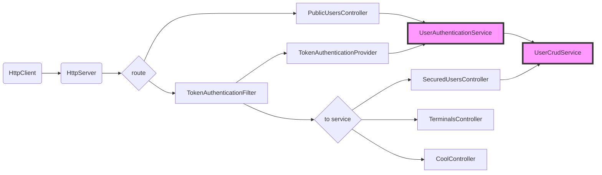

# Objet

Ce projet illustre ma proposition pour gérer la sécurité dans une application Spring. Dans ce framework, la sécurité est adressée par 
le module *spring-boot-starter-security*.

    <dependency>
      <groupId>org.springframework.boot</groupId>
      <artifactId>spring-boot-starter-security</artifactId>
    </dependency>

Ce module est décrit dans le guide [Spring Security Architecture](https://spring.io/guides/topicals/spring-security-architecture/). 
Il fournit un assez bon aperçu sur la philosophie mise en oeuvre.

> Le module et les guides qui l'accompacgnent sont (au 8/2018) très orientés "IHM Web". Je n'ai pas trouvé de moyen simple et *out of the box* de gérer la sécurité d'un serveur d'API.

L'implémentation de cette proposition s'inspire très grandement de ce site: https://octoperf.com/blog/2018/03/08/securing-rest-api-spring-security/. L'implémentation est très propre et claire.

> **ATTENTION** Il se peut que des données sensibles soient **à tord** journalisées... Ceci est un POC.

# Mise en oeuvre

La sécurisation d'un serveur d'API (ou Web d'ailleur) s'appuie sur les éléments suivants
* un **système pour authentifier**: ce dispositif peut être une simple Map mémoire ou une usine tel que LDAP :-). Bref il s'agit de vérifier que *le principal* est connu.
* un **système pour authoriser**: généralement dans Spring des *filtres* qui permettent d'associer des URI et des conditions d'accès (souvent au moyen d'un jeton)
* un **dispositif pour lutter contre les impostures**: on utilise généralement une technique pour signer le jeton (HMAC, ...).

## Principe

Pour gérer la sécurité nous allons:
* insérer un filtrer qui aura la charge de vérifier:
  * la présence d'un jeton
  * que le jeton renvoie bien vers un utilisateur/principal connu
  * que le jeton est encore valide (expiration)
* implémenter un service REST qui aura la charge:
  * d'authentifier un utilisateur en exposant les services telque *login*, *register* ou encore *logout*
  * de faire le lien entre l'application Spring et le serveur LDAP
  * de retrouner, en cas d'authentification réussie, un jeton signé et dont la durée de validité sera maitrisée.

Le diagramme suivant illustre (en gros) ce qui va se passer lorsque l'application tourne:


> **FYI** En rose les interface à retoucher pour l'intégration de LDAP

Une requête est envoyée du client au serveur qui en fonction de l'URL va passer la 
requête à la chaîne de filtrage authentifiée ou non. Dans cette implémentation, si l'URL est 
public (*/public*) la requête jusqu'au controller d'authentificaton qui assurera la contrôle 
d'identité (`login`). Ce controleur délègue à un service dédié le soin de prendre 
les dispositions nécessaires à cette fin.

En revanche si l'URL n'est pas public (différent de */public*), alors la requête est passée au filtre d'autorisation qui:
1. récupère le jeton (qui doit être dans l'entête HTTP)
2. recherche l'utilisateur correspondant
3. vérifie la validité du jeton

Si le jeton est bien connu du notre serveur, Spring va router la requête vers le controlleur de la ressource interrogée.

## Implémentation

Ce projet/proposition est découpé en deux parties:
* ce qui est relatif à spring security (namespace `fr.urbixsoftware.spring.rest.auth`)
* ce qui est du domaine de l'interaction applicative en claire l'API (namespace `fr.urbixsoftware.spring.rest`)
 
L'ensemble du projet est regroupé dans le namespace/package java `fr.urbixsoftware.spring.rest`.

L'intérieur du root namespace est découpé de la manière suivantes:
* `./auth`: Spring security setup, implementation and interfaces 
  * `./services`: classe et interface de service d'authentification
  * `./token`: tout ce qui est nécessaire à la gestion du controle par token.
  * `./configurators`: classe qui permet de paramétrer le fonctionnement du framework Spring.
* `./models`: ensemble des modèles de données manipulés par l'application.
* `./controllers`: les controleurs REST, c'est à dire l'interface que connaîtront les consomateurs de cette API.

### Configuration

La classe `SecurityConfigurator` fait le lien entre les pièces composant le puzzle *spring security* et notre code.

Par exemple, la méthode `configure` (voir exemple) active les options Spring security.

```
  @Override
  protected void configure(final HttpSecurity http) throws Exception {
    http
            .sessionManagement()
            .sessionCreationPolicy(STATELESS)
            .and()
            .exceptionHandling()
            // this entry point handles when you request a protected page and you are not yet
            // authenticated
            .defaultAuthenticationEntryPointFor(forbiddenEntryPoint(), PROTECTED_URLS)
            .and()
            .authenticationProvider(provider)
            .addFilterBefore(restAuthenticationFilter(), AnonymousAuthenticationFilter.class)
            .authorizeRequests()
            .anyRequest()
            .authenticated()
            .and()
            .csrf().disable()
            .formLogin().disable()
            .httpBasic().disable()
            .logout().disable();
  }

```

* Les URL commençant par `/public/**` sont exclus, en conséquence tous ce qui commence par `/public` ne sera pas sécurisé,
* Le filtre `TokenAuthenticationFilter` est enregistré très en amont dans la chaine de filtre de Spring Security . On veut être sur d'intercepter le *token* envoyé,
* Quasi toutes les méthodes en charge d'authentification comme `formLogin` or `httpBasic` sont désactivées puisque nous voulons utiliser notre propre système,
* De la configuration pour empécher l'ajout automatique de filtre Spring Boot.

> ATTENTION Seul la méthode d'authentification par token est retenu en passant notre class `TokenAuthenticationProvider` à la méthode `authenticationProvider`.

En résumé, seul les URI à sécuriser font l'objet d'un contrôle en se basant sur la valeur (**obligatoire**) de la propriété d'entête HTML `Authorization`. Le controle est fait à l'aide d'un filtre qui récupère le jeton et vérifie qu'il existe bien dans la base des utilisateurs authorisés.

La méthode `attemptAuthentication` de notre class `TokenAuthenticationFilter` fait le controle du jeton.

### Authentification par jeton (JWT)

Les jetons [JWT](https://jwt.io/introduction/) sont composés de trois parties séparées par des points:
- un entête (header)
- un payload (des données)
- une signature

L'entête est (en générale) composé de deux champs qui permettent de connaître le type de jeton et l'algorythme de hashage utilisé. La partie payload est composé de `claims`. Un `claim`représente des informations qui décrivent l'entité qui a été authentifiée. Par exemple le nom de l'utilisateur (`username`dans notre cas). Le payload est encodé en `Base64Url`. Enfin la dernière partie est la signature des deux premiers champs (header + payload). C'est cette signature que nous allons contrôler pour nous assurer que c'est bien un jeton que **nous** avons généré.

Un [debugger](https://jwt.io/) peut aider à connaitre ce que notre JWT contient (ce truc marche plus ou moins 8-)).

Les jetons **doivent** être ajoutés aux entêtes des trames HTTP en utilisant:
- la clé: Authorization
- la valeur: Bearer <token>

Ce qui donne donc : `Authorization: Bearer <token>`

### Spring & LDAP

L'interactin avec LDAP se fait au travers de l'interface `LdapTemplate`. Cette interface délègue à une classe `LdapSourceContext`le soin de communiquer avec le serveur.

La configuration se fait classiquement par une classe marquée `@Configuration`.

```
@Configuration
@Primary
public class LdapContextConfigurator extends LdapProperties {

  private static final Logger LOG = Logger.getLogger(LdapContextConfigurator.class.getName());

  /**
   * Context source.
   *
   * @return the ldap context source
   */
  @Bean
  public LdapContextSource ldapContextSource() {
    LOG.info(format("setting up Spring LDAP source context (urls: %s, base: %s: user: %s)",
            Arrays.toString(getUrls()),
            getBase(),
            getUsername()));

    
    LdapContextSource contextSource = new LdapContextSource();
    contextSource.setUrls(getUrls());
    contextSource.setBase(getBase());
    contextSource.setUserDn(getUsername());
    contextSource.setPassword(getPassword());
    
    contextSource.setPooled(true);
    return contextSource;
  }

  /**
   * Ldap template.
   *
   * @return the ldap template
   */
  @Bean
  public LdapTemplate ldapTemplate() {
    LOG.info("setting up Spring LDAP template");
    LdapTemplate ldapTemplate = new LdapTemplate(ldapContextSource());

    return ldapTemplate;
  }
}
```

> **ATTENTION** la classe de base `LdapProperties` est fournie par Spring.

La configuration des propriétés LDAP s'appuie sur un fichier YAML:
```
spring:
  ldap:
    urls: ldap://localhost:389
    password: 'your ldap password'
    username: cn=[canonical user],ou=[organisation unit],o=[organisation],dc=Local
```

Dans le modèle d'implémentation proposé içi, il suffit de fournir un service d'accès aux données utilisateurs s'appuyant sur LDAP. Cette gestion des utilisateurs doit implémenter l'interface `UserCrudService` et utilise l'interface `LdapTemplate` (fournie par Spring) pour remonter les données de profile en interrogeant le serveur LDAP.

Ci après un exemple d'interrogation LDAP avec l'interface Spring

```
@Override
  public Optional<ExtendedUser> findByUsername(String username) {
    
    LOG.info(() -> format("find by user name (user: %s)", username));
    
    ContainerCriteria query = query()
            .attributes(WANTED_ATTRIBUTES)
            .where("cn").is(username);

    List<ExtendedUser> users = ldapTemplate.search(query, new ExtendUserLdapMapper());
    return ofNullable(users.get(0));
  }
```

Dans Spring/LDAP, on fournit une `factory` pour convertir les attributs remontés en une instance de classe `ExtendedUser` Java. Ci-dessous un exemple de `Mapper`

```
 /** This class initializes an ExtendedUser instance using LDAP attributes.
   * 
   */
  private class ExtendUserLdapMapper implements AttributesMapper<ExtendedUser> {

    @Override
    public ExtendedUser mapFromAttributes(Attributes attributes) throws NamingException {
      LOG.info(()-> format("create user instance (attributes: %s)", attributes));
      
      ExtendedUser user =  ExtendedUser.builder()
              .id(attributes.get("uid").get().toString())
              .username(attributes.get("cn").get().toString())
              .password(attributes.get("cn").get().toString())
              .fullName(attributes.get("fullname").get().toString())
              .mail(attributes.get("mail").get().toString())
              .groups(attributes.get("groupMembership").get().toString())
              .enabled(Boolean.parseBoolean(attributes.get("loginDisabled").get().toString()))
              .build();
      
      LOG.finer(() -> format("created user instance: %s",user));
      
      return user;
    }
    
  }
```

### Activer EHCache

Pour éviter de solicité le serveur LDAP à chaque fois qu'un jeton JWT est vérifié, on peut utiliser un cache. J'ai retenu l'implémentation EHCache qui s'active par configuration et l'ajout de quelques annotatin bien choisit.

Le fichier `ehcache.xml` definit comment le cache doit se comporter:
```xml
<?xml version="1.0" encoding="UTF-8"?>
<config
    xmlns:xsi='http://www.w3.org/2001/XMLSchema-instance'
    xmlns:jsr107='http://www.ehcache.org/v3/jsr107'
    xmlns='http://www.ehcache.org/v3'
    xsi:schemaLocation="
        http://www.ehcache.org/v3 http://www.ehcache.org/schema/ehcache-core-3.5.xsd
        http://www.ehcache.org/v3/jsr107 http://www.ehcache.org/schema/ehcache-107-ext-3.5.xsd">

  <service>
    <jsr107:defaults enable-management="false" enable-statistics="true"/>
  </service>

  <cache alias="users">
    <resources>
      <heap unit="entries">2000</heap>
    </resources>
  </cache>
</config>
```

Le fichier de configuration Spring doit contenir:
```
spring:
  cache:
    jcache:
      config: classpath:ehcache.xml
```
> **ATTENTION** Retenez le cache alias `users, il va nous servir pour paramétrer les annotations.

Annotation:
- Activer la fonction de cache Spring avec `@EnableCahing`
- Marquer les méthode qui produisent des données à entrer dans le cache `find` et `findByUsername` avec l'annotation `@CacheResult(cacheName="users")`

Ca devrait être bon.

# More

## performance

Quelques resultats chronométrés:
- OS: Linux RHEL 7 (sur vmware)
- CPU: 4 vCPU
- RAM: 16Go


Sans signature:
- Temps de traitement (avg,min,max): 69ms, 0 ms, 1320ms
- Throughput: > 7000msg/s 

Avec toutes les options (JWT+LDAP+Cache):
- Temps de traitement (avg,min,max): 20,4ms, 0 ms, 699ms
- Throughput: 4700 msg/s 

> **FYI** le @throughput@ est calculé en interrogeant la ressource REST GET `/current`

> **FYI** Ce test peut être refait avec JMeter à l'aide de la commande suivante: `jmeter -n -t jmeter/spring-rest-sample.jmx  -l /tmp/jmeter.res -e -o /tmp/jmeter-report`

Le message remonté par l'appel REST est très simple, ce sont les informations de l'utilisateur correspondant au Token d'autentification. Bref ce test permet seulement de montrer que le surcoût lié au controle systématique de l'authorisation d'accès a un impact faible.

## usefull links

* [Spring security Architecture](https://spring.io/guides/topicals/spring-security-architecture/)
* [Spring security (javadoc)](https://docs.spring.io/spring-security/site/docs/4.2.7.RELEASE/apidocs/)
* [JSON Web Tokens](https://jwt.io/)


